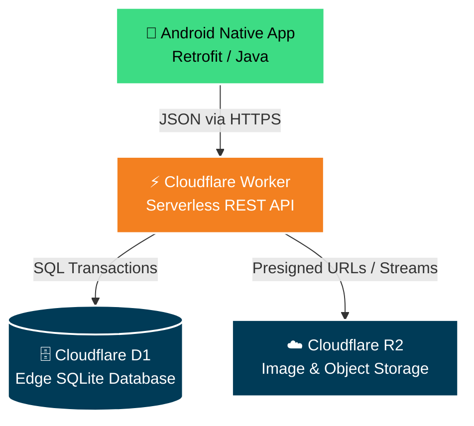
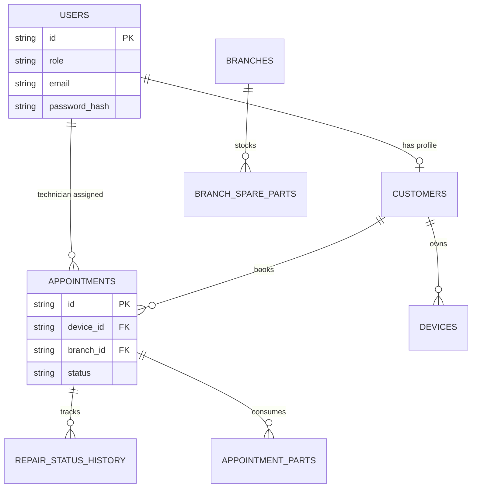

<div align="center">
  
  
  
  # 🛠️ TechFix - Enterprise Repair Management System
  
  **A scalable, multi-role Android application powered by Cloudflare's serverless edge computing.**
  
  [](#)
  [](#)
  [](#)
  [](#)
</div>

---

## 📖 Overview

**TechFix** is a fully comprehensive mobile platform designed to bridge the gap between repair technicians, shop managers, and customers. 
Built as a **Native Android Application**, it leverages an ultra-fast, serverless backend via **Cloudflare Workers** and **D1 (SQLite at the edge)**.

From real-time GPS tracking to multi-tier Role-Based Access Control (RBAC), TechFix removes the friction from technical repair lifecycles.

---

## ✨ Features by Role

TechFix enforces strict RBAC (Role-Based Access Control) to deliver customized dashboard experiences based on the user's role.

| 🧑‍💻 **Customer** | 🛠️ **Technician** | 📊 **Manager** | ⚙️ **Admin** |
| :--- | :--- | :--- | :--- |
| • Device Registration & Mgt<br>• Real-time Repair Tracking<br>• Automated GPS Addressing<br>• View Detailed Invoices<br>• Profile Customization | • View Assigned Tasks<br>• Update Repair Statuses<br>• Consume Spare Parts<br>• Upload Photographic Evidence<br>• Process Customer Payments | • Full Branch Management<br>• Global Inventory Ledger<br>• Assign Tasks to Techs<br>• Revenue & Sales Reports<br>• Monitor All Branch Activity | • Manage All Users<br>• System-wide Settings<br>• High-level Diagnostics<br>• Database Administration |

---

## 🏗️ System Architecture

TechFix relies on an Edge-First architecture, ensuring extremely low latency and high availability by executing the backend on Cloudflare's global CDN nodes.



---

## 🗄️ Database Schema Snapshot

The D1 database is completely normalized to ensure data integrity during parallel API transactions.



---

## 🚀 Complete Setup Guide

Follow these steps to deploy both the backend and frontend locally or to production.

### 1️⃣ Backend Setup (Cloudflare Workers + D1)

**Prerequisites:** 
- Install [Node.js](https://nodejs.org/) and NPM.
- Install Wrangler CLI: `npm install -g wrangler`

<details>
<summary><b>Click to expand backend deployment steps</b></summary>
<br>

1. **Login to Cloudflare**
   ```bash
   npx wrangler login
   ```
2. **Navigate to the Backend Directory**
   ```bash
   cd cloudflare-backend
   ```
3. **Initialize the Database**
   Create a new D1 database via your Cloudflare Dashboard, or using the CLI:
   ```bash
   npx wrangler d1 create techfix-db
   ```
   *Copy the generated `database_id` and paste it into `cloudflare-backend/wrangler.toml`.*
4. **Run the Schema Migrations**
   Push the table structures to your remote D1 instance:
   ```bash
   npx wrangler d1 execute techfix-db --remote --file=./schema.sql
   ```
5. **Deploy the Worker**
   ```bash
   npx wrangler deploy
   ```
   *This will output a live URL (e.g., `https://techfix-backend.<your-subdomain>.workers.dev`)*.

</details>

### 2️⃣ Frontend Setup (Android Studio)

**Prerequisites:**
- Install [Android Studio](https://developer.android.com/studio) (Giraffe or later).
- Java Development Kit (JDK 17).

<details>
<summary><b>Click to expand Android setup steps</b></summary>
<br>

1. **Open the Project**
   Open the root `TECHFIX` folder inside Android Studio.
2. **Connect the Backend API**
   Open the following file:
   `app/src/main/java/com/mad/techfix/network/RetrofitClient.java`
   
   Replace the `BASE_URL` with your Cloudflare Worker deployment URL:
   ```java
   private static final String BASE_URL = "https://techfix-backend.codse251f-003.workers.dev/";
   ```
3. **Sync and Build**
   - Wait for Gradle to sync dependencies.
   - Click **Run (Shift + F10)** to launch the app on an emulator or physical device.

</details>

---

## 🛡️ Security & Authentication
* **PBKDF2 Hashing:** Passwords are never stored in plaintext. They are salted and hashed using 100k iterations of PBKDF2 (SHA-256) inside the V8 engine natively on the Cloudflare Edge.
* **JWT (JSON Web Tokens):** Secure, stateless session management. Tokens include expiration claims and strict signature validation.
* **Granular API Interceptors:** All API endpoints automatically validate the user's role claim against the required permissions before executing queries.

---

## 👥 Meet the Team (Contributors)

* **Member 1 (System Admin & Customer Features):** Role assignments, Device management, Location services, Main Dashboard configurations.
* **Member 2 (Manager & Core Logic):** Branch handling, Global Inventory ledgers, High-level Reporting, Data visualization.
* **Member 3 (Android Architecture):** Auth (Login/Register) workflows, UI layouts, Retrofit abstractions, Application foundation.
* **Member 4 (Technician & Repair Lifecycles):** Payment intents, Status history chronologies, Camera image evidence modules.

---

<div align="center">
  <i>Built with ❤️ for the Mobile Application Development Module.</i>
</div>